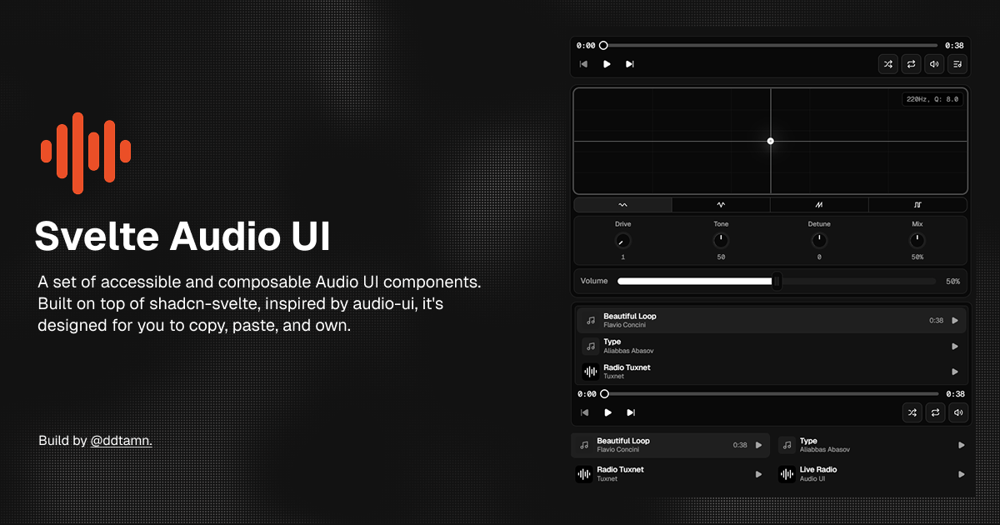

<div align="center">
  
  <br />
  <br />

  <p>A set of accessible, composable audio UI components for Svelte.<br/>Built on top of shadcn-svelte. Copy, paste, and own.</p>

  <p>
    <a href="https://svelte-audio-ui.vercel.app/docs">Docs</a> ·
    <a href="https://svelte-audio-ui.vercel.app/particles">Particles</a> ·
    <a href="https://github.com/ddtamn/svelte-audio-ui/issues">Issues</a>
  </p>

  
  
</div>

---

## What is this?

**Svelte Audio UI** is a collection of audio-focused UI components that you install via the [shadcn-svelte](https://shadcn-svelte.com) CLI. No npm package — you own the code.

Components include: `AudioPlayer`, `AudioQueue`, `AudioTrack`, `AudioProvider`, `Knob`, `Fader`, `Slider`, `XYPad`, `SortableList`, and more.

## Quick Start

Make sure you have [shadcn-svelte](https://shadcn-svelte.com/docs/installation) initialized, then:

```sh
npx shadcn-svelte@latest add https://svelte-audio-ui.vercel.app/r/player.json
```

Add `AudioProvider` to your root layout:

```svelte
<script lang="ts">
  import { AudioProvider } from "$lib/components/ui/audio/provider/index.js";
  let { children } = $props();
</script>

<AudioProvider>{@render children()}</AudioProvider>
```

Use a component:

```svelte
<script lang="ts">
  import * as AudioPlayer from "$lib/components/ui/audio/player/index.js";
</script>

<AudioPlayer.Root>
  <AudioPlayer.ControlBar>
    <AudioPlayer.Play />
    <AudioPlayer.SeekBar />
    <AudioPlayer.Volume />
  </AudioPlayer.ControlBar>
</AudioPlayer.Root>
```

## Tech Stack

- Svelte 5 + SvelteKit
- TypeScript
- Tailwind CSS v4
- bits-ui · shadcn-svelte · svelte-dnd-action

## Contributing

See [CONTRIBUTING.md](./CONTRIBUTING.md).

## Acknowledgements

Inspired by [audio-ui](https://audio-ui.xyz), a composable audio UI system for React.

This project brings similar ideas into the Svelte ecosystem, adapting the original headless and provider-based architecture for Svelte.

If you're working with React, check out the original project:
[audio-ui](https://audio-ui.xyz)

## License

[MIT](./LICENSE) © [ddtamn](https://github.com/ddtamn)
